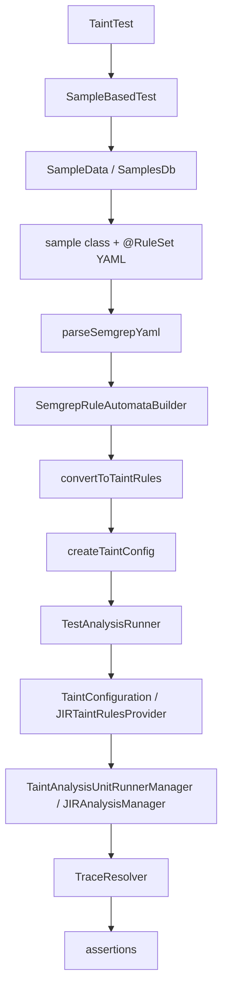
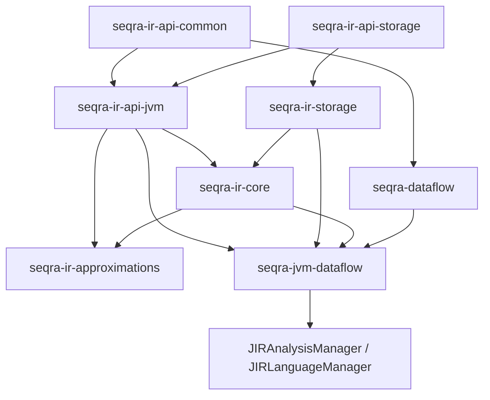
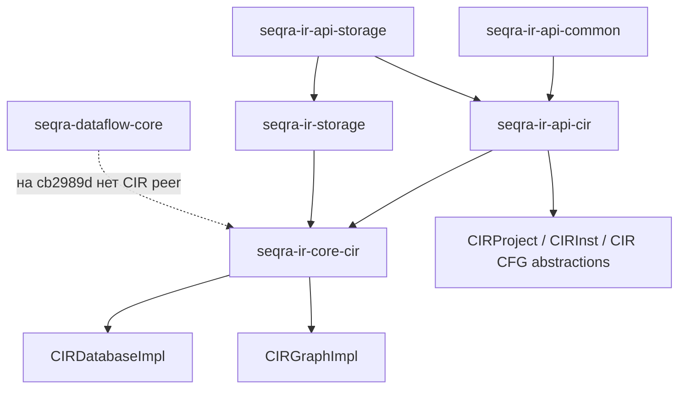
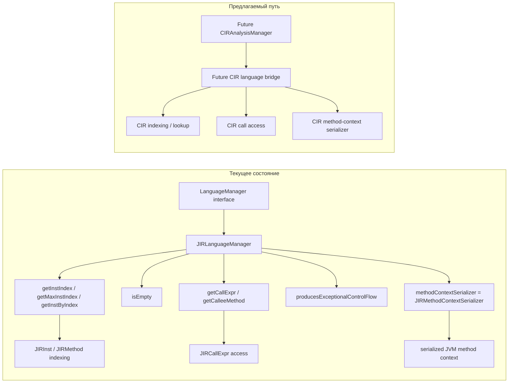
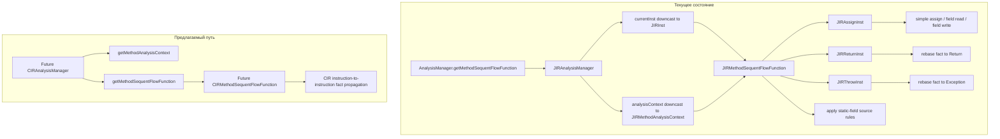
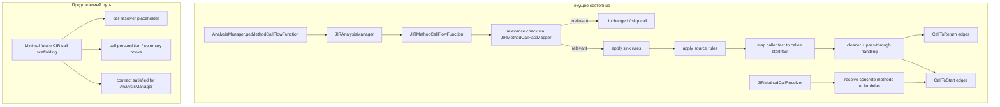

# Слайд 1

## Тезис

На коммите `cb2989d` `TaintTest` представляет собой закреплённый на коммите JVM-конвейер от Semgrep к IFDS: тест наследует общую загрузку сэмплов, находит класс сэмпла и связанный с ним YAML через `@RuleSet`, преобразует Semgrep YAML в конфигурацию taint-анализа, запускает JVM taint-движок, восстанавливает трассы и затем проверяет позитивные и негативные assertions.

## Диаграмма



## Доказательства

- `seqra-cir-sast/seqra-java-semgrep/src/test/kotlin/org/seqra/semgrep/TaintTest.kt`: `TaintTest` — это только конечная тестовая поверхность; фактическое выполнение он наследует от `SampleBasedTest` и вызывает `runTest<...>()` для taint-сэмплов.
- `seqra-cir-sast/seqra-java-semgrep/src/test/kotlin/org/seqra/semgrep/util/SampleBasedTest.kt`: `runClassTest(...)` загружает `SampleData`, вызывает `parseSemgrepYaml`, `SemgrepRuleAutomataBuilder`, `convertToTaintRules`, `createTaintConfig`, а затем передаёт результат в `TestAnalysisRunner`.
- `seqra-cir-sast/seqra-java-semgrep/src/test/kotlin/org/seqra/semgrep/util/SampleData.kt`: `SamplesDb` открывает sample jar, находит подклассы `base.RuleSample`, читает у каждого sample-класса аннотацию `base.RuleSet` и загружает соответствующий YAML-текст.
- `seqra-cir-sast/seqra-java-semgrep/samples/src/main/java/base/RuleSet.java`: `@RuleSet` — это runtime-retained annotation, которая связывает каждый sample-класс с одним YAML rule resource.
- `seqra-cir-sast/seqra-java-semgrep/src/main/kotlin/org/seqra/semgrep/pattern/SemgrepYamlParsing.kt`: `parseSemgrepYaml(...)` превращает сырой YAML в объекты `SemgrepYamlRuleSet` / `SemgrepYamlRule`.
- `seqra-cir-sast/seqra-java-semgrep/src/main/kotlin/org/seqra/semgrep/pattern/conversion/SemgrepRuleAutomataBuilder.kt`: `SemgrepRuleAutomataBuilder.build(...)` преобразует разобранные Semgrep-правила в accepting automata и разрешённые metavariable metadata.
- `seqra-cir-sast/seqra-java-semgrep/src/main/kotlin/org/seqra/semgrep/pattern/conversion/taint/AutomataToTaintRuleConversion.kt`: `convertToTaintRules(...)` преобразует automata в serialized taint-rule items.
- `seqra-cir-sast/seqra-java-semgrep/src/main/kotlin/org/seqra/semgrep/pattern/TaintRuleFromSemgrep.kt`: `createTaintConfig()` упаковывает преобразованные Semgrep taint rules в `SerializedTaintConfig`.
- `seqra-cir-sast/seqra-java-semgrep/src/test/kotlin/org/seqra/semgrep/util/TestAnalysisRunner.kt`: test runner загружает `TaintConfiguration`, оборачивает её в `JIRTaintRulesProvider`, создаёт `TaintAnalysisUnitRunnerManager(JIRAnalysisManager(cp), ...)`, запускает анализ и восстанавливает трассы через `TraceResolver.Params()`.
- `seqra-cir-sast/seqra-jvm-sast-dataflow/src/main/kotlin/org/seqra/jvm/sast/dataflow/rules/TaintConfiguration.kt`: `TaintConfiguration` — это слой materialization правил, который индексирует `entry`, `source`, `sink`, `pass-through`, `cleaner`, `method-exit` и `analysis-end` rules относительно JIR methods/fields.
- `seqra-cir-sast/seqra-jvm-sast-dataflow/src/main/kotlin/org/seqra/jvm/sast/dataflow/JIRTaintRulesProvider.kt`: `JIRTaintRulesProvider` возвращает эти разрешённые JVM taint rules обратно в generic IFDS engine.
- `seqra-dataflow-core/seqra-jvm-dataflow/src/main/kotlin/org/seqra/dataflow/jvm/ap/ifds/analysis/JIRAnalysisManager.kt`: `JIRAnalysisManager` — это JVM bridge, который поставляет method contexts, а также start, sequent и call flow functions для shared runner.
- `seqra-dataflow-core/seqra-dataflow/src/main/kotlin/org/seqra/dataflow/ap/ifds/TaintAnalysisUnitRunnerManager.kt`: shared manager владеет `runAnalysis(...)`, сбором vulnerabilities и `resolveVulnerabilityTraces(...)`.
- `seqra-dataflow-core/seqra-dataflow/src/main/kotlin/org/seqra/dataflow/ap/ifds/trace/TraceResolver.kt`: `TraceResolver.resolveTrace(...)` восстанавливает граф трассы от source к sink и от entrypoint к start, который затем проверяется в assertions.

# Слайд 2

## Тезис

Текущая JVM-иерархия на `cb2989d` — это единственная IR-ветка, которая продолжается дальше общих контрактов в полноценный analysis-oriented stack: `seqra-ir-api-jvm` лежит поверх общей базы, `seqra-ir-core` её реализует, `seqra-ir-approximations` её расширяет, а `seqra-dataflow-core` добавляет сверху JVM-only bridge `seqra-jvm-dataflow`.

## Диаграмма



## Доказательства

- `seqra-ir/settings.gradle.kts`: workspace `seqra-ir` включает и shared-, и branch-specific modules, включая `seqra-ir-api-jvm`, `seqra-ir-core` и `seqra-ir-approximations`.
- `seqra-ir/seqra-ir-api-jvm/build.gradle.kts`: `seqra-ir-api-jvm` — branch module, построенный поверх `seqra-ir-api-common` и `seqra-ir-api-storage`.
- `seqra-ir/seqra-ir-api-jvm/src/main/kotlin/org/seqra/ir/api/jvm/Api.kt`: JVM-ветка открывает JIR-facing entry points для database/classpath.
- `seqra-ir/seqra-ir-api-jvm/src/main/kotlin/org/seqra/ir/api/jvm/cfg/JIRInst.kt`: JVM-ветка публикует детальный JIR instruction/CFG vocabulary.
- `seqra-ir/seqra-ir-storage/build.gradle.kts`: `seqra-ir-storage` — это shared concrete persistence layer под обеими core-ветками.
- `seqra-ir/seqra-ir-core/build.gradle.kts`: `seqra-ir-core` зависит от `seqra-ir-api-jvm` и `seqra-ir-storage`, поэтому текущий исполняемый core на этой стороне — JVM-specific.
- `seqra-ir/seqra-ir-approximations/build.gradle.kts`: `seqra-ir-approximations` зависит от `seqra-ir-api-jvm` и `seqra-ir-core`, что подтверждает: approximations продолжают только JVM-ветку.
- `seqra-dataflow-core/settings.gradle.kts`: dataflow workspace содержит только `seqra-dataflow` и `seqra-jvm-dataflow`.
- `seqra-dataflow-core/seqra-dataflow/build.gradle.kts`: `seqra-dataflow` — это generic IFDS layer над common IR abstractions.
- `seqra-dataflow-core/seqra-jvm-dataflow/build.gradle.kts`: `seqra-jvm-dataflow` зависит от `seqra-dataflow`, `seqra_ir_api_jvm`, `seqra_ir_core` и shared storage artifacts.
- `seqra-dataflow-core/seqra-jvm-dataflow/src/main/kotlin/org/seqra/dataflow/jvm/ap/ifds/JIRLanguageManager.kt`: language bridge здесь конкретно JIR-specific, а не нейтральный multi-language adapter.
- `seqra-dataflow-core/seqra-jvm-dataflow/src/main/kotlin/org/seqra/dataflow/jvm/ap/ifds/analysis/JIRAnalysisManager.kt`: текущий analysis manager stack поверх generic IFDS реализован только для JVM.

# Слайд 3

## Тезис

Текущая CIR-иерархия на `cb2989d` реальна, но короче: `seqra-ir-api-cir` — это параллельная API-ветка поверх общей базы, `seqra-ir-core-cir` реализует загрузку CIR и CFG traversal на shared storage, и на этом ветка пока заканчивается, не продолжаясь в `seqra-dataflow-core`.

## Диаграмма



## Доказательства

- `seqra-ir/settings.gradle.kts`: `seqra-ir-api-cir` и `seqra-ir-core-cir` являются first-class subproject внутри того же workspace, что и JVM-ветка.
- `seqra-ir/seqra-ir-api-cir/build.gradle.kts`: `seqra-ir-api-cir` зависит от тех же shared base pieces, что и JVM API-ветка: `seqra-ir-api-common` и `seqra-ir-api-storage`.
- `seqra-ir/seqra-ir-api-cir/src/main/kotlin/org/seqra/ir/api/cir/API.kt`: CIR API-ветка открывает контракты загрузки/classpath для `CIRDatabase`.
- `seqra-ir/seqra-ir-api-cir/src/main/kotlin/org/seqra/ir/api/cir/CIRProject.kt`: ветка включает CIR project/target model, а не использует JVM-only project abstractions.
- `seqra-ir/seqra-ir-api-cir/src/main/kotlin/org/seqra/ir/api/cir/cfg/CIRCommons.kt`: CIR-ветка определяет собственные CFG/value/type abstractions.
- `seqra-ir/seqra-ir-api-cir/src/main/kotlin/org/seqra/ir/api/cir/cfg/CIRInst.kt`: CIR API публикует instruction-level CIR entities, но всё ещё на уровне IR/CFG abstractions.
- `seqra-ir/seqra-ir-core-cir/build.gradle.kts`: `seqra-ir-core-cir` зависит от `seqra-ir-api-cir` и `seqra-ir-storage`, поэтому его текущая implementation boundary — это CIR core плюс shared storage.
- `seqra-ir/seqra-ir-core-cir/src/main/kotlin/org/jacodb/impl/CIRDatabaseImpl.kt`: `CIRDatabaseImpl` — concrete loader/persistence implementation на CIR-стороне.
- `seqra-ir/seqra-ir-core-cir/src/main/kotlin/org/jacodb/impl/cfg/CIRGraphImpl.kt`: `CIRGraphImpl` материализует CFG successor/predecessor traversal по CIR blocks и instructions.
- `seqra-dataflow-core/settings.gradle.kts`: отсутствие CIR-side subproject внутри `seqra-dataflow-core` — ключевое доказательство того, что текущая CIR-ветка заканчивается до shipped IFDS/dataflow bridge.

# Слайд 4

## Тезис

Разрыв на `cb2989d` состоит не в том, что CIR не хватает IR-сущностей; он в том, что JVM-ветка уже продолжается вниз в approximations и `seqra-dataflow-core`, тогда как CIR-ветка сейчас заканчивается после API/core/storage/CFG abstractions и потому не имеет bridge, эквивалентного `seqra-jvm-dataflow`.

## Диаграмма

```text
Возможность / Слой                        | JVM: текущее состояние                   | CIR: текущее состояние                   | Видимый разрыв на cb2989d
----------------------------------------- | ---------------------------------------- | ---------------------------------------- | --------------------------
Общая IR-база                             | seqra-ir-api-common + api-storage        | seqra-ir-api-common + api-storage        | Разрыва нет
Поверхность branch API                    | seqra-ir-api-jvm                         | seqra-ir-api-cir                         | Разрыва в существовании ветки нет
Concrete storage layer                    | seqra-ir-storage                         | seqra-ir-storage                         | Разрыва нет
Branch core implementation                | seqra-ir-core                            | seqra-ir-core-cir                        | Разрыва в существовании core нет
Подробная CFG/instruction model ветки     | JIRDatabase / JIRInst                    | CIRDatabase / CIRProject / CIRInst       | Разный vocabulary, обе стороны существуют
Approximation/downstream extension        | seqra-ir-approximations присутствует     | нет параллельного CIR approximation      | Продолжение только у JVM
IFDS/dataflow root                        | seqra-dataflow + seqra-jvm-dataflow      | seqra-dataflow без CIR peer              | CIR bridge отсутствует
Language-specific analysis manager        | JIRAnalysisManager существует            | CIRAnalysisManager отсутствует в дереве  | Главный архитектурный разрыв
Рабочий trace-producing path в тестах     | TestAnalysisRunner -> TaintAnalysis...   | параллельный CIR taint path отсутствует  | Рабочий путь есть только у JVM
```

## Доказательства

- `seqra-ir/settings.gradle.kts`: подтверждает, что обе ветки делят один верхнеуровневый IR workspace, но отличаются тем, что именно продолжается downstream.
- `seqra-ir/seqra-ir-api-jvm/build.gradle.kts` и `seqra-ir/seqra-ir-api-cir/build.gradle.kts`: обе API-ветки существуют поверх одной shared base.
- `seqra-ir/seqra-ir-core/build.gradle.kts` и `seqra-ir/seqra-ir-core-cir/build.gradle.kts`: у обеих веток также есть concrete core implementation layer.
- `seqra-ir/seqra-ir-approximations/build.gradle.kts`: только у JVM-стороны есть approximation/downstream extension module.
- `seqra-dataflow-core/settings.gradle.kts`: `seqra-dataflow-core` включает `seqra-dataflow` и `seqra-jvm-dataflow`, без параллельного CIR bridge module.
- `seqra-dataflow-core/seqra-jvm-dataflow/src/main/kotlin/org/seqra/dataflow/jvm/ap/ifds/analysis/JIRAnalysisManager.kt`: shipped language-specific manager поверх generic IFDS является JVM-specific.
- `seqra-ir/seqra-ir-api-cir/src/main/kotlin/org/seqra/ir/api/cir/API.kt`, `seqra-ir/seqra-ir-api-cir/src/main/kotlin/org/seqra/ir/api/cir/CIRProject.kt` и `seqra-ir/seqra-ir-api-cir/src/main/kotlin/org/seqra/ir/api/cir/cfg/CIRInst.kt`: у CIR уже есть полноценные IR/project/CFG abstractions, поэтому недостающая часть — это downstream analysis continuation, а не само существование ветки.

# Слайд 5

## Тезис

Текущее состояние: `JIRLanguageManager` — это JVM-specific bridge, который делает generic IFDS contracts исполнимыми над JIR. Он downcast-ит shared `CommonMethod` / `CommonInst` / `CommonCallExpr` в JIR types, даёт indexing и lookup для instructions, открывает call extraction и callee access, а также поставляет сериализацию JVM method-context для runner-а.

Предлагаемый путь: использовать это разделение как шаблон для будущего CIR bridge. Indexing, call access и method-context serialization должны остаться в CIR language-manager layer ниже любого будущего `CIRAnalysisManager`, а не быть слитыми в один класс.

## Диаграмма



## Доказательства

- `seqra-dataflow-core/seqra-jvm-dataflow/src/main/kotlin/org/seqra/dataflow/jvm/ap/ifds/JIRLanguageManager.kt`: `JIRLanguageManager(val cp: JIRClasspath) : LanguageManager` — это concrete bridge class, а не нейтральный adapter.
- `seqra-dataflow-core/seqra-jvm-dataflow/src/main/kotlin/org/seqra/dataflow/jvm/ap/ifds/JIRLanguageManager.kt`: `getInstIndex`, `getMaxInstIndex`, `getInstByIndex` и `isEmpty` downcast-ят к `JIRInst` / `JIRMethod` и отвечают shared runner-у в терминах JIR.
- `seqra-dataflow-core/seqra-jvm-dataflow/src/main/kotlin/org/seqra/dataflow/jvm/ap/ifds/JIRLanguageManager.kt`: `getCallExpr(...)` возвращает `inst.callExpr`, `getCalleeMethod(...)` возвращает `callExpr.method.method`, а `producesExceptionalControlFlow(...)` считает `JIRThrowInst` exceptional control flow.
- `seqra-dataflow-core/seqra-jvm-dataflow/src/main/kotlin/org/seqra/dataflow/jvm/ap/ifds/JIRLanguageManager.kt`: `override val methodContextSerializer = JIRMethodContextSerializer(cp)` — это context-serialization hook, который позволяет common engine сохранять и восстанавливать JVM analysis contexts.
- `seqra-dataflow-core/seqra-dataflow/src/main/kotlin/org/seqra/dataflow/ap/ifds/analysis/AnalysisManager.kt`: shared IFDS layer зависит от `LanguageManager`, поэтому `JIRLanguageManager` является JVM bridge point между common abstractions и JIR indexing/call access/context serialization.

# Слайд 6

## Тезис

Текущее состояние: `getMethodSequentFlowFunction(...)` — это JVM bridge hook для instruction-to-instruction propagation. `JIRAnalysisManager` превращает текущий `CommonInst` и method analysis context в `JIRMethodSequentFlowFunction`, а этот объект переписывает taint facts через assignments, field reads/writes, returns, throws и unconditional static-field sources по одной JIR instruction за раз.

Предлагаемый путь: первый CIR bridge может быть узким именно здесь. Самая ранняя честная CIR-side реализация должна лишь открыть тот же seam: один method-context и одну per-instruction sequent flow function, оставив более богатое call-поведение для следующего этапа.

## Диаграмма



## Доказательства

- `seqra-dataflow-core/seqra-jvm-dataflow/src/main/kotlin/org/seqra/dataflow/jvm/ap/ifds/analysis/JIRAnalysisManager.kt`: `getMethodSequentFlowFunction(...)` downcast-ит `currentInst` и `analysisContext`, а затем возвращает `JIRMethodSequentFlowFunction(apManager, analysisContext, currentInst)`.
- `seqra-dataflow-core/seqra-dataflow/src/main/kotlin/org/seqra/dataflow/ap/ifds/analysis/AnalysisManager.kt`: shared IFDS contract требует per-instruction `MethodSequentFlowFunction`, поэтому этот hook — это bridge от common IFDS scheduling к JVM instruction semantics.
- `seqra-dataflow-core/seqra-jvm-dataflow/src/main/kotlin/org/seqra/dataflow/jvm/ap/ifds/analysis/JIRMethodSequentFlowFunction.kt`: `propagate(...)` ветвится по `JIRAssignInst`, `JIRReturnInst` и `JIRThrowInst`, сохраняя unchanged facts там, где это нужно, и rebasing facts в `AccessPathBase.Return` или `AccessPathBase.Exception` на выходах.
- `seqra-dataflow-core/seqra-jvm-dataflow/src/main/kotlin/org/seqra/dataflow/jvm/ap/ifds/analysis/JIRMethodSequentFlowFunction.kt`: `sequentFlowAssign(...)` дальше разделяет propagation instruction-to-instruction на simple assignment, field read и field write, включая alias-aware propagation и field-exclusion refinement.
- `seqra-dataflow-core/seqra-jvm-dataflow/src/main/kotlin/org/seqra/dataflow/jvm/ap/ifds/analysis/JIRMethodSequentFlowFunction.kt`: `applyMethodExitSinkRules(...)` и `applyUnconditionalSources()` показывают, что sequent flow function — это также точка, где к текущей instruction привязываются exit sinks и unconditional static-field sources.

# Слайд 7

## Тезис

Текущее состояние: `getMethodCallFlowFunction(...)` — это interprocedural hook уровня call-site. `JIRAnalysisManager` упаковывает return value, call expression, statement и method context в `JIRMethodCallFlowFunction`, которая решает, должен ли факт остаться у caller, перейти в callee-start facts или сразу вернуться в caller-return facts через source/sink/cleaner/pass-through logic, тогда как `JIRMethodCallResolver` отдельно отвечает за разрешение реальных target methods.

Предлагаемый путь: это не часть самого минимального первого CIR milestone. Будущий CIR bridge на старте может предоставить только минимальные call-layer scaffolds, чтобы честно удовлетворить контракт `AnalysisManager`, а уже потом нарастить более богатое CIR call-flow behavior после появления sequent-flow seam.

## Диаграмма



## Доказательства

- `seqra-dataflow-core/seqra-jvm-dataflow/src/main/kotlin/org/seqra/dataflow/jvm/ap/ifds/analysis/JIRAnalysisManager.kt`: `getMethodCallFlowFunction(...)` downcast-ит `returnValue`, `callExpr`, `statement` и `analysisContext`, а затем возвращает `JIRMethodCallFlowFunction(...)`.
- `seqra-dataflow-core/seqra-jvm-dataflow/src/main/kotlin/org/seqra/dataflow/jvm/ap/ifds/analysis/JIRMethodCallFlowFunction.kt`: `propagateFact(...)` сначала спрашивает у `JIRMethodCallFactMapper.factIsRelevantToMethodCall(...)`, относится ли текущий факт к данному call-site; нерелевантные факты становятся `Unchanged`.
- `seqra-dataflow-core/seqra-jvm-dataflow/src/main/kotlin/org/seqra/dataflow/jvm/ap/ifds/analysis/JIRMethodCallFlowFunction.kt`: call flow function применяет call-site sink rules, method source rules и `mapMethodCallToStartFlowFact(...)`, а затем выпускает `CallToReturn...` и `CallToStart...` edges в зависимости от того, должна ли call быть локально суммаризирована или entered interprocedurally.
- `seqra-dataflow-core/seqra-jvm-dataflow/src/main/kotlin/org/seqra/dataflow/jvm/ap/ifds/analysis/JIRMethodCallFlowFunction.kt`: `applyPassRulesOrCallToStart(...)` явно показывает главную точку решения: cleaner/pass-through handling может удержать анализ на стороне caller, иначе факт rebased в callee-start position и отправляется внутрь callee.
- `seqra-dataflow-core/seqra-jvm-dataflow/src/main/kotlin/org/seqra/dataflow/jvm/ap/ifds/analysis/JIRMethodCallResolver.kt`: target resolution находится рядом, но отдельно от flow function; `JIRMethodCallResolver` разрешает concrete methods и lambda-backed methods, а затем передаёт их runner-у, чтобы call flow edges знали, в какие callee analyses входить.

# Слайд 8

## Тезис

Текущее состояние: на CIR-стороне уже есть IR-ингредиенты, достаточные для разговора о projects, functions, instructions и CFG traversal, но на `cb2989d` под `seqra-dataflow-core` всё ещё нет CIR peer module, поэтому пока не существует реальной реализации `CIRAnalysisManager`, которую можно было бы показывать как текущее поведение.

Предлагаемый путь: даже минимальный `CIRAnalysisManager` — это всё ещё задача по построению bridge, а не просто один новый class file. Даже если самый первый manager будет содержательно реализовывать только `getMethodAnalysisContext(...)` и `getMethodSequentFlowFunction(...)`, ему всё равно понадобятся CIR language manager, application-graph adapter, unit resolver и context-serialization pieces, а также минимальные call-layer scaffolds, чтобы shared contract `AnalysisManager` можно было инстанцировать честно.

## Диаграмма

```text
Текущее состояние
-----------------
seqra-ir-api-cir            -> CIRDatabase / CIRProject / CIRInst / MLIR value+type abstractions
seqra-ir-core-cir           -> CIRGraphImpl: CFG traversal по CIR blocks/instructions
seqra-dataflow-core         -> только seqra-dataflow + seqra-jvm-dataflow
Разрыв на cb2989d           -> нет CIR peer module, нет CIRAnalysisManager в дереве

Предлагаемый путь
-----------------
1. Добавить CIR language bridge   -> mapping CommonMethod/CommonInst, indexing, call access, context serializer
2. Добавить CIR graph + unit hooks -> application graph adapter и CIR unit resolver/context pieces
3. Добавить минимальный analysis seam -> CIR method analysis context + getMethodSequentFlowFunction
4. Добавить минимальные call scaffolds -> no-op/minimal call resolver, call precondition/summary hooks, требуемые AnalysisManager
5. Затем ввести                    -> минимальный CIRAnalysisManager как первый честный dataflow bridge
```

## Доказательства

- `seqra-ir/seqra-ir-api-cir/src/main/kotlin/org/seqra/ir/api/cir/API.kt`: у CIR уже есть `CIRDatabase` APIs для loading/classpath/project-facing boundary, то есть ветка реально существует на IR-уровне.
- `seqra-ir/seqra-ir-api-cir/src/main/kotlin/org/seqra/ir/api/cir/cfg/CIRCommons.kt` и `seqra-ir/seqra-ir-api-cir/src/main/kotlin/org/seqra/ir/api/cir/cfg/CIRInst.kt`: CIR уже открывает `CIRInst`, `MLIRValue`, call-like instructions вроде `CIRCallOpInst`, а также точки выравнивания с `CommonInst` / `CommonValue`.
- `seqra-ir/seqra-ir-core-cir/src/main/kotlin/org/seqra/ir/impl/cfg/CIRGraphImpl.kt`: `CIRGraphImpl` уже даёт successor/predecessor traversal по CIR blocks и terminating instructions, то есть именно тот CFG substrate, на котором сможет стоять будущий dataflow bridge.
- `seqra-dataflow-core/settings.gradle.kts`: текущий dataflow workspace включает только `seqra-dataflow` и `seqra-jvm-dataflow`, и это прямое доказательство того, что у `seqra-dataflow-core` нет CIR peer module на `cb2989d`.
- `seqra-dataflow-core/seqra-dataflow/src/main/kotlin/org/seqra/dataflow/ap/ifds/analysis/AnalysisManager.kt`: shared manager contract требует не только один-два override; реальный bridge должен предоставить language-manager behavior, method context, sequent/call/start flow functions, call resolver/preconditions/summary handling, reachability checks и exit-fact validation.
- `seqra-dataflow-core/seqra-jvm-dataflow/src/main/kotlin/org/seqra/dataflow/jvm/ap/ifds/JIRLanguageManager.kt` и `seqra-dataflow-core/seqra-jvm-dataflow/src/main/kotlin/org/seqra/dataflow/jvm/ap/ifds/analysis/JIRAnalysisManager.kt`: JVM-сторона показывает минимальную честную архитектурную форму для подражания: language manager под analysis manager и отдельные sequent/call hooks вместо одного монолитного класса.

---

# Отчёт: переименование jacodb → seqra-ir-core-cir

## Изменённые файлы в `seqra-ir/seqra-ir-core-cir`

| Тип | Было | Стало |
|-----|------|-------|
| Папка с исходниками | `src/main/kotlin/org/jacodb/impl/` | `src/main/kotlin/org/seqra/ir/impl/` |
| Файл фабрики | `jacodb.kt` | `cirDatabase.kt` |
| Функция-фабрика (×2) | `fun jacodb(...)` | `fun cirDatabase(...)` |
| Import в тестах (×7) | `import org.seqra.ir.impl.jacodb` | `import org.seqra.ir.impl.cirDatabase` |
| Вызовы фабрики (×12) | `jacodb(...)` | `cirDatabase(...)` |
| SPI-дескриптор | `META-INF/services/org.jacodb.impl.CIRDatabasePersistenceSPI` | `META-INF/services/org.seqra.ir.impl.CIRDatabasePersistenceSPI` |
| Пути в `.cir`-фикстурах | `/Users/sergey/Documents/jacodb/jacodb-core-cir/` | `/Users/z.dmitriy/seqra-cir/seqra-ir/seqra-ir-core-cir/` |
| Пути в `.cir`-фикстурах | `/home/sergey/Documents/jacodb/jacodb-core-cir/` | `/Users/z.dmitriy/seqra-cir/seqra-ir/seqra-ir-core-cir/` |

## Затронутые файлы

**Исходники (перемещены через `git mv`):**
- 27 файлов из `org/jacodb/impl/` → `org/seqra/ir/impl/` (включая подпапки `cfg/`, `cfg/builder/`, `features/`, `ir/`, `sources/`, `storage/`, `types/`)

**Тестовые файлы (обновлён import + вызовы):**
- `src/testFixtures/kotlin/StorageImpl.kt`
- `src/test/kotlin/SyntheticStorageTest.kt`
- `src/test/kotlin/StorageTestWithLinkCommands.kt`
- `src/test/kotlin/ModuleTest.kt`
- `src/test/kotlin/JulietTest.kt`
- `src/test/kotlin/DurabilityTest.kt`
- `src/test/kotlin/DatabaseTest.kt`

**Ресурсы:**
- `src/main/resources/META-INF/services/org.seqra.ir.impl.CIRDatabasePersistenceSPI` (переименован)

**Тестовые фикстуры (обновлены пути):**
- `src/test/resources/doubleModuleWithLinkCommandsTypes/mainModule.cir`
- `src/test/resources/doubleModuleWithLinkCommandsTypes/helperModule.cir`
- `src/test/resources/doubleModuleWithLinkCommands/mainModule.cir`
- `src/test/resources/doubleModuleWithLinkCommands/helperModule.cir`
- `src/test/resources/failingParsingTest/helperModule.cir`

**Документация (создана):**
- `seqra-ir/seqra-ir-core-cir/README.md`
- `seqra-ir/seqra-ir-core-cir/AGENTS.md`

## `seqra-ir-api-cir`

Вхождений `jacodb` не обнаружено — изменений не требовалось.
