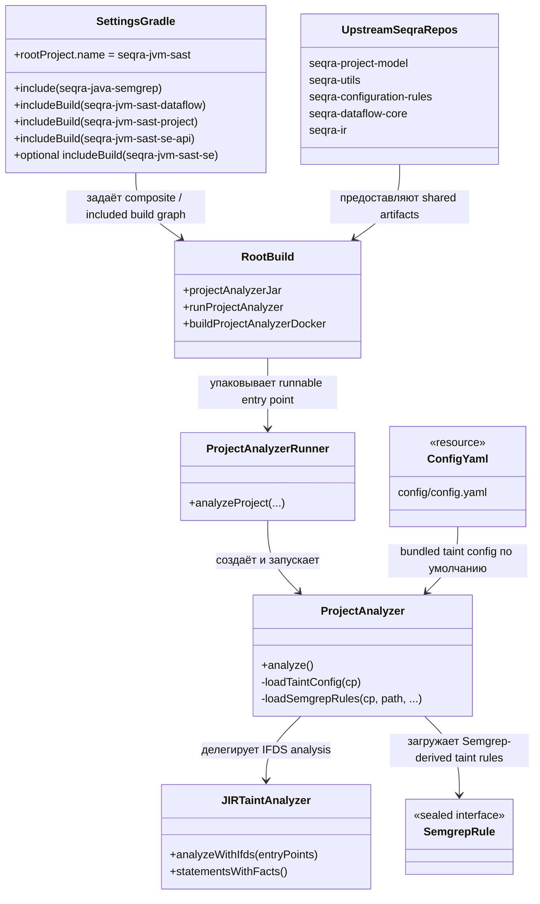

# seqra-cir-sast

## Роль на cb2989d

`seqra-cir-sast` — это точка сборки Seqra JVM SAST product на `cb2989d`, а не монолитная single-module build. Его корневая сборка связывает исполняемый анализатор, локальный Gradle subproject `seqra-java-semgrep` и несколько соседних JVM SAST builds через Gradle composite-build `includeBuild` entries.

На этом коммите собранный продукт предоставляет `ProjectAnalyzerRunner` как CLI entry point, делегирует orchestration в `ProjectAnalyzer`, использует `JIRTaintAnalyzer` для IFDS-based taint analysis и опционального symbolic execution, а также может заменить YAML taint rules на правила, полученные из `seqra-java-semgrep`. Корневая сборка также подтягивает upstream artifacts из `seqra-project-model`, `seqra-utils`, `seqra-configuration-rules`, `seqra-dataflow-core` и `seqra-ir`, поэтому граница этого репозитория — это граница сборки анализатора, а не полная реализация всех зависимостей.

## Граница сборки

Граница сборки по замыслу composite.

- `seqra-cir-sast/settings.gradle.kts` задаёт имя root build `seqra-jvm-sast`, включает локальный проект `seqra-java-semgrep` и использует `includeBuild(...)` вместе с dependency substitution для `seqra-jvm-sast-dataflow`, `seqra-jvm-sast-project` и `seqra-jvm-sast-se-api`.
- Тот же settings-файл включает `seqra-jvm-sast-se` только если существует `seqra-jvm-sast-se/settings.gradle.kts`, поэтому поддержка symbolic execution на `cb2989d` является optional local included build, а не безусловным in-tree module.
- `seqra-cir-sast/build.gradle.kts` собирает исполняемый анализатор, зависит от координат included-build `org.seqra.sast:project`, `org.seqra.sast:dataflow` и `org.seqra.sast.se:api`, а также зависит от `project(":seqra-java-semgrep")` для загрузки правил Semgrep.
- `seqra-cir-sast/buildSrc/src/main/kotlin/SeqraProjectDependency.kt`, `SeqraUtilDependency.kt`, `SeqraConfigurationDependency.kt` и `SeqraIrDependency.kt` сопоставляют upstream artifacts с внешними репозиториями `seqra-project-model`, `seqra-utils`, `seqra-configuration-rules` и `seqra-ir`.
- `seqra-cir-sast/.gitmodules` объявляет `seqra-dataflow-core` как submodule, а `seqra-cir-sast/build.gradle.kts` и включённые sub-builds потребляют артефакты `org.seqra.seqra-dataflow-core:*` из этой upstream-линии.

Итак, честная граница здесь такова: одна root product build, которая композитно собирает локальные SAST-компоненты и upstream Seqra libraries в runnable JVM analyzer distribution.

## Отношения между сущностями

На уровне продукта важны следующие связи:

- `seqra-cir-sast/settings.gradle.kts` — это assembly map: он объявляет root build, subproject `seqra-java-semgrep` и included JVM SAST builds.
- `seqra-cir-sast/build.gradle.kts` — это product wiring layer: он собирает analyzer jar, task для шифрования конфигурации, task для Docker image и runtime classpath для собранного анализатора.
- `seqra-cir-sast/src/main/kotlin/org/seqra/jvm/sast/runner/ProjectAnalyzerRunner.kt` — CLI entry point, который собирает analysis options, custom config и входы с Semgrep rules.
- `seqra-cir-sast/src/main/kotlin/org/seqra/jvm/sast/project/ProjectAnalyzer.kt` — orchestrator, который выбирает default YAML config или правила `seqra-java-semgrep`, запускает IFDS analysis, опционально вызывает symbolic execution и генерирует SARIF.
- `seqra-cir-sast/seqra-jvm-sast-dataflow/src/main/kotlin/org/seqra/jvm/sast/dataflow/JIRTaintAnalyzer.kt` — included-build analysis engine, который выполняет taint analysis и генерацию traces над JIR.
- `seqra-cir-sast/seqra-java-semgrep/src/main/kotlin/org/seqra/semgrep/pattern/SemgrepRule.kt` определяет модель Semgrep taint и matching rules, которую `ProjectAnalyzer` может загрузить в analyzer configuration.
- `seqra-cir-sast/config/config.yaml` — это bundled default taint-rule baseline, особенно для pass-through behavior, когда Semgrep input не передан.

Связь выглядит так: assembly map → product wiring → runner → analyzer orchestration → included-build engine, при этом конфигурация приходит либо из bundled YAML, либо из Semgrep rule sets.

## Архитектура

`seqra-cir-sast` следует composite product architecture:

1. Gradle settings собирают root build из одного локального subproject (`seqra-java-semgrep`) и нескольких included JVM SAST builds.
2. Корневой `build.gradle.kts` подменяет опубликованные analyzer modules локальными included builds, когда они доступны, и подтягивает оставшиеся shared libraries из upstream Seqra repositories.
3. `ProjectAnalyzerRunner` преобразует CLI flags в вызов `ProjectAnalyzer`.
4. `ProjectAnalyzer` загружает либо bundled YAML configuration из `config/config.yaml`, либо Semgrep-derived taint rules из `seqra-java-semgrep`.
5. `JIRTaintAnalyzer` запускает IFDS taint analysis, сохраняет summaries при необходимости, генерирует SARIF и опционально передаёт traces в symbolic-execution API, если эта возможность доступна.

Именно поэтому модуль нужно описывать как точку сборки продукта: верхнеуровневая сборка композитно связывает analyzer subsystems и upstream libraries через границы репозиториев, вместо того чтобы определять каждый analysis component внутри одного Gradle-модуля.

## Высокоуровневый UML

## Доказательства

- `seqra-cir-sast/settings.gradle.kts`: показывает composite-build structure, включая `seqra-java-semgrep`, local dependency substitution для included JVM SAST builds и условное поведение `includeBuild("seqra-jvm-sast-se")`.
- `seqra-cir-sast/build.gradle.kts`: собирает runnable analyzer, зависит от included-build coordinates (`org.seqra.sast:project`, `org.seqra.sast:dataflow`, `org.seqra.sast.se:api`), зависит от `project(":seqra-java-semgrep")` и потребляет upstream артефакты `org.seqra.seqra-dataflow-core:seqra-jvm-dataflow`, `seqra-project-model`, `seqra-utils`, `seqra-configuration-rules` и `seqra-ir` через buildSrc helpers.
- `seqra-cir-sast/buildSrc/src/main/kotlin/SeqraProjectDependency.kt`: сопоставляет `org.seqra.project:seqra-project-model` с репозиторием `seqra-project-model`.
- `seqra-cir-sast/buildSrc/src/main/kotlin/SeqraUtilDependency.kt`: сопоставляет `org.seqra.utils:seqra-jvm-util` и `org.seqra.utils:cli-util` с репозиторием `seqra-utils`.
- `seqra-cir-sast/buildSrc/src/main/kotlin/SeqraConfigurationDependency.kt`: сопоставляет `org.seqra.configuration:configuration-rules-jvm` с репозиторием `seqra-configuration-rules`.
- `seqra-cir-sast/buildSrc/src/main/kotlin/SeqraIrDependency.kt`: сопоставляет артефакты `seqra-ir-*` с репозиторием `seqra-ir`.
- `seqra-cir-sast/.gitmodules`: фиксирует `seqra-dataflow-core` как upstream submodule dependency line.
- `seqra-cir-sast/src/main/kotlin/org/seqra/jvm/sast/runner/ProjectAnalyzerRunner.kt`: предоставляет CLI options для custom config, загрузки Semgrep rules, IFDS settings и symbolic execution.
- `seqra-cir-sast/src/main/kotlin/org/seqra/jvm/sast/project/ProjectAnalyzer.kt`: выбирает между default YAML config и Semgrep-derived rules, а затем запускает IFDS analysis, генерацию SARIF и optional symbolic execution.
- `seqra-cir-sast/seqra-jvm-sast-dataflow/src/main/kotlin/org/seqra/jvm/sast/dataflow/JIRTaintAnalyzer.kt`: содержит JIR taint-analysis engine, используемый product assembly.
- `seqra-cir-sast/seqra-java-semgrep/src/main/kotlin/org/seqra/semgrep/pattern/SemgrepRule.kt`: определяет модель правил Semgrep, которая подаётся в analyzer, когда переданы Semgrep rules.
- `seqra-cir-sast/config/config.yaml`: задаёт bundled default pass-through taint configuration, используемую при отсутствии Semgrep input.
