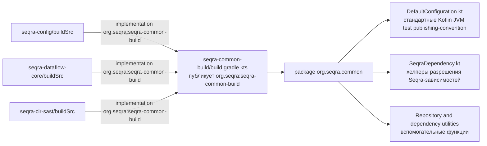

# seqra-common-build

## Роль на cb2989d

`seqra-common-build` — это публикуемый модуль Gradle с общими build-convention. На коммите `cb2989d` он нужен для упаковки общих Kotlin DSL-хелперов и стандартных настроек сборки, которые соседние репозитории подключают из своих `buildSrc`-проектов как `org.seqra:seqra-common-build`.

## Граница сборки

Граница этого модуля ограничена build-инфраструктурой. Верхнеуровневый `build.gradle.kts` применяет `kotlin-dsl` и `maven-publish`, задаёт публикуемые координаты в пространстве `org.seqra` и публикует Java-компонент вместе с sources. Модуль не определяет runtime-сервис и не является самостоятельным приложением в этом workspace.

## Отношения между сущностями

- Публикуемый артефакт собирается из `seqra-common-build/build.gradle.kts`.
- `seqra-common-build/src/main/kotlin/org/seqra/common/DefaultConfiguration.kt` задаёт переиспользуемые настройки Kotlin, JVM, тестов и публикации для Gradle-проектов.
- `seqra-common-build/src/main/kotlin/org/seqra/common/SeqraDependency.kt` определяет хелперы зависимостей, которые разрешают версионированные Seqra-артефакты и добавляют нужный package repository.
- Соседние репозитории потребляют этот артефакт из своих `buildSrc`-проектов, например `seqra-config/buildSrc/build.gradle.kts`, `seqra-dataflow-core/buildSrc/build.gradle.kts` и `seqra-cir-sast/buildSrc/build.gradle.kts`.

## Архитектура

Архитектура здесь тонкая и артефактно-ориентированная: в центре находится один экспортируемый Kotlin DSL package — `org.seqra.common`. Внутри него модуль объединяет два типа build-convention:

1. Стандартную конфигурацию проекта: настройки компилятора Kotlin, Java compilation, запуск тестов через JUnit Platform и Maven publishing по умолчанию.
2. Хелперы зависимостей и репозиториев: строки зависимостей на основе version properties и подключение GitHub Packages для Seqra-артефактов.

Соседние репозитории не расширяют этот модуль как вложенный subproject. Вместо этого каждый соседний `buildSrc` объявляет бинарную зависимость на опубликованный артефакт, а затем использует экспортируемые хелперы в своей локальной build-логике.

## Высокоуровневый UML

## Доказательства

Все пути ниже существуют на коммите `cb2989d`:

- `seqra-common-build/build.gradle.kts`
- `seqra-common-build/src/main/kotlin/org/seqra/common/DefaultConfiguration.kt`
- `seqra-common-build/src/main/kotlin/org/seqra/common/SeqraDependency.kt`
- `seqra-common-build/src/main/kotlin/org/seqra/common/Repositories.kt`
- `seqra-common-build/src/main/kotlin/org/seqra/common/DependencyUtil.kt`
- `seqra-common-build/src/main/kotlin/org/seqra/common/KotlinDependency.kt`
- `seqra-config/buildSrc/build.gradle.kts`
- `seqra-dataflow-core/buildSrc/build.gradle.kts`
- `seqra-cir-sast/buildSrc/build.gradle.kts`
