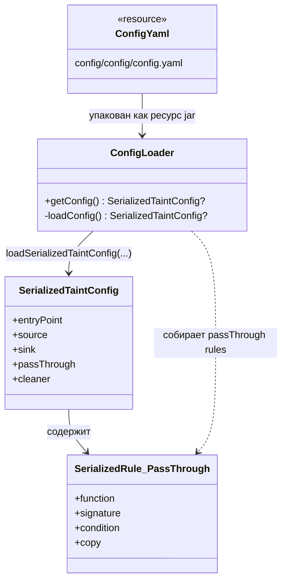

# seqra-config

## Роль на cb2989d

`seqra-config` — это модуль упаковки и загрузки конфигурации для Seqra JVM taint rules. Он упаковывает YAML-файлы в публикуемый jar, а затем предоставляет `ConfigLoader` как небольшую runtime-точку входа, которая читает эти ресурсы из jar и возвращает значение `SerializedTaintConfig`. Этот модуль не запускает IFDS-анализ и не является самим taint-analysis engine.

Модуль зависит от `seqra-configuration-rules`, а именно от артефакта `configuration-rules-jvm`, который даёт сериализованную модель правил и код десериализации YAML. Иными словами, `seqra-config` поставляет rule-data и loader, а `seqra-configuration-rules` определяет конфигурационную схему, которую этот loader читает.

## Граница сборки

Граница сборки намеренно узкая.

- `seqra-config/build.gradle.kts` применяет Kotlin conventions plugin, добавляет одну implementation-зависимость на `seqraRulesJvm` и копирует локальный каталог `config/` в processed resources.
- `seqra-config/buildSrc/src/main/kotlin/SeqraConfigurationDependency.kt` разрешает `seqraRulesJvm` из репозитория `seqra-configuration-rules` как `org.seqra.configuration:configuration-rules-jvm`.
- `seqra-config/src/main/kotlin/org/seqra/config/ConfigLoader.kt` читает `/config` из ресурсов jar, фильтрует `.yaml`, десериализует каждый файл через `loadSerializedTaintConfig` и объединяет найденные правила `passThrough` в возвращаемый `SerializedTaintConfig`.

Это означает, что граница модуля такая: упаковать config-data, загрузить её из опубликованного jar и вернуть объекты конфигурации, типизированные библиотекой правил выше по стеку.

## Отношения между сущностями

На уровне конфигурации важны следующие связи:

- `config/config/config.yaml` — это конкретные rule-data, упакованные в jar.
- `ConfigLoader` — единственная точка входа загрузчика внутри модуля.
- `ConfigLoader` преобразует встроенный YAML в объекты `SerializedTaintConfig`, вызывая parser из `configuration-rules-jvm`.
- `SerializedTaintConfig` — это контейнер для сериализованных групп правил, таких как `entryPoint`, `source`, `sink`, `passThrough` и `cleaner`.
- `SerializedRule.PassThrough` — форма правила, которую этот модуль сейчас извлекает из встроенных YAML-файлов и возвращает потребителям.

То есть связь здесь такая: data file → loader → upstream schema. Схема живёт в `seqra-configuration-rules`, а упакованная конфигурация — здесь.

## Архитектура

`seqra-config` следует тонкой артефактной архитектуре:

1. Создать YAML rule-файлы в `seqra-config/config/`.
2. Скопировать эти файлы в jar во время `ProcessResources`.
3. Загрузить `/config` из classpath во время выполнения.
4. Разобрать каждый YAML с помощью upstream serialization helpers.
5. Вернуть объединённый `SerializedTaintConfig` для downstream-потребителей.

Для потребителей важна одна деталь: `ConfigLoader` ожидает, что ресурсы будут приходить из URI типа `jar`. Если URI ресурса не `jar`, он возвращает `null`, вместо попытки читать файлы из распакованного каталога. Поэтому этот модуль прежде всего является distribution artifact, а не локальным source-tree configuration service.

## Высокоуровневый UML

## Доказательства

- `seqra-config/build.gradle.kts`: объявляет Kotlin-модуль, зависит от `seqraRulesJvm` и копирует `config/` в resources.
- `seqra-config/buildSrc/src/main/kotlin/SeqraConfigurationDependency.kt`: сопоставляет `seqraRulesJvm` с `org.seqra.configuration:configuration-rules-jvm` из репозитория `seqra-configuration-rules`.
- `seqra-config/src/main/kotlin/org/seqra/config/ConfigLoader.kt`: загружает упакованные в jar ресурсы `/config`, разбирает YAML и возвращает объединённый `SerializedTaintConfig` на основе `passThrough` entries.
- `seqra-config/config/config/config.yaml`: содержит конкретные сериализованные pass-through rules, которые читает loader.
- `seqra-configuration-rules/configuration-rules-jvm/src/main/kotlin/org/seqra/dataflow/configuration/jvm/serialized/SerializedTaintConfig.kt`: определяет контейнер сериализованной конфигурации и YAML loader, который использует `ConfigLoader`.
- `seqra-configuration-rules/configuration-rules-jvm/src/main/kotlin/org/seqra/dataflow/configuration/jvm/serialized/SerializedRule.kt`: определяет сериализованные rule-сущности, включая `SerializedRule.PassThrough`.
