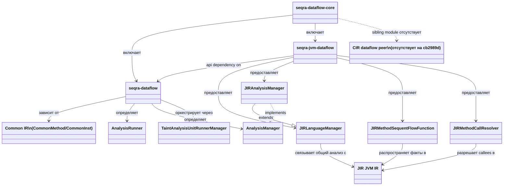

# seqra-dataflow-core

## Роль на cb2989d

`seqra-dataflow-core` — это workspace для dataflow-анализа, разделённый на `cb2989d` на один переиспользуемый IFDS layer и один JVM-specific bridge. `seqra-dataflow` содержит общие analysis contracts, orchestration runner-ов и taint-analysis machinery поверх `CommonMethod`/`CommonInst`, а `seqra-jvm-dataflow` зависит от этого ядра и связывает его с JIR-based JVM IR. Текущее состояние в корне этого модуля явно JVM-only со стороны language bridge: sibling CIR dataflow subproject здесь нет.

## Граница сборки

`seqra-dataflow-core/settings.gradle.kts` включает ровно два subproject: `seqra-dataflow` и `seqra-jvm-dataflow`. Общий артефакт `seqra-dataflow` публикует IFDS core с `api(seqra_ir_api_common)` и общими configuration/util dependencies, чтобы downstream-реализации могли работать против общей IR-абстракции. `seqra-jvm-dataflow` публикует второй артефакт, который экспортирует `api(project(":seqra-dataflow"))`, а затем добавляет JVM-only зависимости вроде `seqra_ir_api_jvm`, `seqra_ir_core`, `seqra_ir_api_storage`, `seqra_ir_storage` и JVM taint-rule/config support. Такое разделение делает границу переиспользуемого solver layer явной и удерживает JIR integration в отдельном bridge-layer.

## Отношения между сущностями

- `seqra-dataflow` определяет переиспользуемые IFDS-facing contracts. `AnalysisRunner` связывает application graph, access-path manager, language-specific `AnalysisManager`, runner manager и method-call resolver.
- `AnalysisManager` — это extension seam между generic runner и concrete language bridge. Он запрашивает у bridge method contexts, flow functions, call resolution, reachability checks, exit-fact validation и progress reporting.
- `TaintAnalysisUnitRunnerManager` — высокоуровневый orchestrator в common module. Он группирует start methods по unit, запускает per-unit runner-ы, хранит summaries, восстанавливает traces и координирует завершение анализа.
- `seqra-jvm-dataflow` реализует этот seam только для JVM IR. `JIRLanguageManager` — не общий multi-language manager; он downcast-ит общие интерфейсы в `JIRMethod`, `JIRInst` и `JIRCallExpr` и предоставляет JIR-specific indexing, call extraction и context serialization.
- `JIRAnalysisManager` расширяет `JIRLanguageManager` и поставляет JVM-specific method-analysis context, call resolver, start/sequent/call flow functions, preconditions и fact validation, используемые shared IFDS runner.
- `JIRMethodSequentFlowFunction` — одна из concrete transfer-function реализаций JVM bridge. Она переписывает факты для assignments, returns, throws, field reads/writes и source/sink handling на уровне отдельных JIR instructions.
- `JIRMethodCallResolver` — JVM-specific interprocedural bridge. Он разрешает concrete callees и lambda-backed callees, а затем передаёт их обратно в общий `TaintAnalysisUnitRunner` workflow.
- На `cb2989d` под `seqra-dataflow-core` нет параллельного CIR dataflow artifact, поэтому общий IFDS layer сейчас имеет только JVM bridge.

## Архитектура

Архитектура намеренно двухуровневая. Нижний уровень, `seqra-dataflow`, владеет analysis protocol: generic runner interfaces, access-path-based IFDS contracts, unit-level scheduling, summary persistence и trace reconstruction. Он остаётся привязанным к общей IR-поверхности (`CommonMethod`, `CommonInst`, `CommonCallExpr`, `CommonValue`), поэтому solver layer сам по себе не зависит от JVM-классов.

Верхний уровень, `seqra-jvm-dataflow`, — concrete adapter, который делает эти абстракции исполнимыми для JIR. `JIRLanguageManager` определяет, как общие инструкции отображаются в JIR indexing и call access, `JIRAnalysisManager` строит JVM-aware analysis contexts и flow-function objects, `JIRMethodSequentFlowFunction` выполняет propagation на уровне instruction, а `JIRMethodCallResolver` превращает call sites в concrete или lambda-resolved JVM targets. Поскольку корень не включает CIR-side peer, текущую архитектуру надо читать как «generic IFDS core плюс JVM bridge», а не как уже завершённый multi-language dataflow stack.

## Высокоуровневый UML

## Доказательства

- `seqra-dataflow-core/settings.gradle.kts`: корень включает только `seqra-dataflow` и `seqra-jvm-dataflow`, и это ключевое доказательство разделения модуля и отсутствия CIR peer.
- `seqra-dataflow-core/seqra-dataflow/build.gradle.kts`: граница общего артефакта, публикация и зависимость от `seqra_ir_api_common`, а не от JVM-specific IR APIs.
- `seqra-dataflow-core/seqra-jvm-dataflow/build.gradle.kts`: граница JVM bridge через `api(project(":seqra-dataflow"))` и JVM-only IR/storage dependencies.
- `seqra-dataflow-core/seqra-dataflow/src/main/kotlin/org/seqra/dataflow/ap/ifds/AnalysisRunner.kt`: общий runner contract, связывающий graph, access-path manager, analysis manager, runner manager и call resolver.
- `seqra-dataflow-core/seqra-dataflow/src/main/kotlin/org/seqra/dataflow/ap/ifds/analysis/AnalysisManager.kt`: generic IFDS extension seam для language-specific contexts, flow functions, call handling и fact validation.
- `seqra-dataflow-core/seqra-dataflow/src/main/kotlin/org/seqra/dataflow/ap/ifds/TaintAnalysisUnitRunnerManager.kt`: общий orchestration layer для per-unit runner-ов, summaries, vulnerabilities и trace resolution.
- `seqra-dataflow-core/seqra-jvm-dataflow/src/main/kotlin/org/seqra/dataflow/jvm/ap/ifds/JIRLanguageManager.kt`: JIR-only реализация `LanguageManager` и method-context serializer.
- `seqra-dataflow-core/seqra-jvm-dataflow/src/main/kotlin/org/seqra/dataflow/jvm/ap/ifds/analysis/JIRAnalysisManager.kt`: JVM-specific реализация `AnalysisManager`, связывающая shared IFDS hooks с JIR analysis contexts и flow functions.
- `seqra-dataflow-core/seqra-jvm-dataflow/src/main/kotlin/org/seqra/dataflow/jvm/ap/ifds/analysis/JIRMethodSequentFlowFunction.kt`: concrete JVM sequent transfer logic для assignment, return, throw, source и sink propagation.
- `seqra-dataflow-core/seqra-jvm-dataflow/src/main/kotlin/org/seqra/dataflow/jvm/ap/ifds/analysis/JIRMethodCallResolver.kt`: JVM-specific call-resolution path, включая lambda subscription и передачу resolved callees обратно в common runner.
