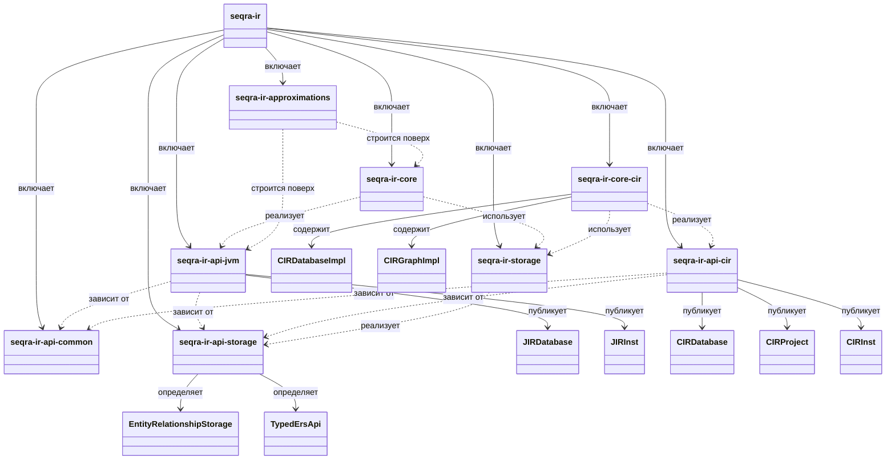

# seqra-ir

## Роль на cb2989d

`seqra-ir` — это локальная IR-платформа репозитория на `cb2989d`. Его верхнеуровневый `settings.gradle.kts` разделяет работу на общие API-контракты (`seqra-ir-api-common`, `seqra-ir-api-storage`), две входные IR-ветки (`seqra-ir-api-jvm` и `seqra-ir-api-cir`), persistence и implementation layers (`seqra-ir-storage`, `seqra-ir-core`, `seqra-ir-core-cir`) и один JVM-side approximation module (`seqra-ir-approximations`). Вместе эти модули определяют, как Seqra загружает program representations, хранит сущности и отношения и предоставляет CFG-oriented IR models, не сводя JVM и CIR stacks в один pipeline.

## Граница сборки

Граница сборки — это composite из восьми Gradle-модулей, объявленный в `seqra-ir/settings.gradle.kts`: `seqra-ir-api-cir`, `seqra-ir-api-common`, `seqra-ir-api-jvm`, `seqra-ir-api-storage`, `seqra-ir-approximations`, `seqra-ir-core`, `seqra-ir-core-cir` и `seqra-ir-storage`. Общая база явно видна в build-файлах subproject: `seqra-ir-api-jvm` и `seqra-ir-api-cir` оба публикуются поверх `seqra-ir-api-common` и `seqra-ir-api-storage`; `seqra-ir-storage` упаковывает concrete storage layer за storage API; `seqra-ir-core` зависит от JVM API и storage implementation; `seqra-ir-core-cir` зависит от CIR API и storage implementation; а `seqra-ir-approximations` зависит от JVM API и `seqra-ir-core`, а не от CIR-ветки.

## Отношения между сущностями

- `seqra-ir-api-common` — это нижний shared contract layer для IR-wide concepts, которые переиспользуют обе API-ветки.
- `seqra-ir-api-storage` определяет storage-facing abstractions, включая транзакции `EntityRelationshipStorage` и typed ERS helpers, чтобы обе IR-ветки могли сохранять symbols и graph entities через одну общую модель.
- `seqra-ir-api-jvm` — JVM/bytecode-oriented API branch. `JIRDatabase` управляет bytecode locations и classpaths, а `JIRInst` и связанные expression/value types предоставляют детальную JVM CFG/instruction model.
- `seqra-ir-api-cir` — CIR/MLIR-oriented API branch. `CIRDatabase` и `CIRProject` описывают загрузку CIR bitcode и project-target resolution, а типы около `CIRInst` и `CIRGraph` открывают CIR operations, functions, blocks и CFG references.
- `seqra-ir-storage` — concrete persistence layer, который реализует переиспользуемую ERS-backed storage boundary, используемую обеими core-ветками.
- `seqra-ir-core` — JVM implementation layer над storage. Его build зависит от `seqra-ir-api-jvm` и `seqra-ir-storage`, что делает его мостом от JVM API contracts к исполняемой загрузке IR и downstream JVM analysis support.
- `seqra-ir-core-cir` — CIR implementation layer над storage. `CIRDatabaseImpl` загружает CIR modules в persistence, а `CIRGraphImpl` материализует CFG successor/predecessor relationships из CIR basic blocks.
- `seqra-ir-approximations` — это JVM-only add-on layer: его build зависит от `seqra-ir-api-jvm` и `seqra-ir-core`, сохраняя approximation logic на JVM-стороне, а не на CIR-стороне.

## Архитектура

`seqra-ir` имеет намеренно layered architecture, а не один универсальный IR-path.

Внизу `seqra-ir-api-common` и `seqra-ir-api-storage` задают shared contracts: общие IR-типы с одной стороны и entity-relationship persistence APIs — с другой. `EntityRelationshipStorage` и `TypedErsApi` показывают, что storage является самостоятельной и переиспользуемой границей, а не просто implementation detail одной ветки.

Выше этой общей базы модуль расходится на две API-ветки. JVM-ветка открывает bytecode-oriented entry point в `Api.kt` и богатый CFG/instruction vocabulary в `cfg/JIRInst.kt`. CIR-ветка открывает параллельный, но другой вход через `API.kt`, project/target model в `CIRProject.kt` и CIR-specific CFG/instruction abstractions в `cfg/CIRCommons.kt` и `cfg/CIRInst.kt`.

Implementation layers тоже остаются раздельными. `seqra-ir-core` лежит под JVM API-веткой, а `seqra-ir-core-cir` — под CIR API-веткой и использует `CIRDatabaseImpl` вместе с `CIRGraphImpl`, чтобы загружать модули и строить CFG navigation поверх CIR blocks. `seqra-ir-storage` остаётся shared concrete persistence layer под обеими core-ветками.

Текущее состояние: именно JVM-ветка продолжается в approximation-heavy и downstream IFDS/dataflow-oriented usage, потому что `seqra-ir-approximations` зависит от `seqra-ir-api-jvm` и `seqra-ir-core`. CIR-ветка пока заканчивается на IR/storage/CFG abstractions: у неё есть API surface, project model, persistence hooks и реализация CFG graph, но этот README не должен представлять её как уже имеющую dataflow bridge.

## Высокоуровневый UML

## Доказательства

- `seqra-ir/settings.gradle.kts`: authoritative top-level inventory для восьми in-scope subproject внутри `seqra-ir`.
- `seqra-ir/seqra-ir-api-common/build.gradle.kts`: граница shared API-common artifact.
- `seqra-ir/seqra-ir-api-storage/build.gradle.kts`: граница shared storage-API artifact.
- `seqra-ir/seqra-ir-api-jvm/build.gradle.kts`: JVM API-ветка зависит от `seqra-ir-api-common` и `seqra-ir-api-storage`.
- `seqra-ir/seqra-ir-api-jvm/src/main/kotlin/org/seqra/ir/api/jvm/Api.kt`: bytecode/classpath entry points `JIRDatabase` и persistence-facing JVM API.
- `seqra-ir/seqra-ir-api-jvm/src/main/kotlin/org/seqra/ir/api/jvm/cfg/JIRInst.kt`: богатая поверхность JVM CFG и instruction model.
- `seqra-ir/seqra-ir-api-cir/build.gradle.kts`: CIR API-ветка зависит от `seqra-ir-api-common` и `seqra-ir-api-storage`.
- `seqra-ir/seqra-ir-api-cir/src/main/kotlin/org/seqra/ir/api/cir/API.kt`: контракты `CIRDatabase` для loading, classpath и persistence.
- `seqra-ir/seqra-ir-api-cir/src/main/kotlin/org/seqra/ir/api/cir/CIRProject.kt`: абстракция target/project для CIR inputs.
- `seqra-ir/seqra-ir-api-cir/src/main/kotlin/org/seqra/ir/api/cir/cfg/CIRCommons.kt`: общие CIR CFG/value/type abstractions.
- `seqra-ir/seqra-ir-api-cir/src/main/kotlin/org/seqra/ir/api/cir/cfg/CIRInst.kt`: CIR instruction surface, показывающая, что ветка пока заканчивается на IR/CFG abstractions.
- `seqra-ir/seqra-ir-api-storage/src/main/kotlin/org/seqra/ir/api/storage/ers/EntityRelationshipStorage.kt`: переиспользуемый ERS transaction и storage contract.
- `seqra-ir/seqra-ir-api-storage/src/main/kotlin/org/seqra/ir/api/storage/ers/typed/TypedErsApi.kt`: typed storage helpers, разделяемые над storage layer.
- `seqra-ir/seqra-ir-storage/build.gradle.kts`: concrete shared storage layer, построенный на storage API.
- `seqra-ir/seqra-ir-core/build.gradle.kts`: JVM core layer зависит от `seqra-ir-api-jvm` и `seqra-ir-storage`.
- `seqra-ir/seqra-ir-core-cir/build.gradle.kts`: CIR core layer зависит от `seqra-ir-api-cir` и `seqra-ir-storage`.
- `seqra-ir/seqra-ir-core-cir/src/main/kotlin/org/jacodb/impl/CIRDatabaseImpl.kt`: CIR implementation загружает module sources в persistence и classpaths.
- `seqra-ir/seqra-ir-core-cir/src/main/kotlin/org/jacodb/impl/cfg/CIRGraphImpl.kt`: реализация CIR CFG graph поверх instructions и block edges.
- `seqra-ir/seqra-ir-approximations/build.gradle.kts`: JVM-only approximation layer зависит от `seqra-ir-api-jvm` и `seqra-ir-core`.
