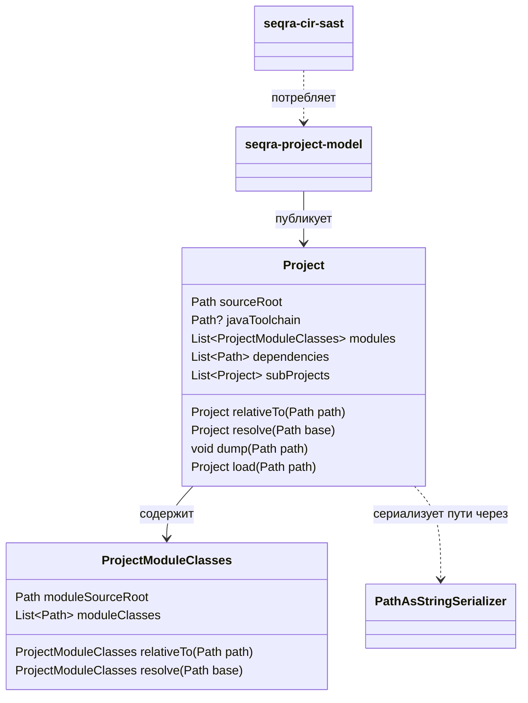

# seqra-project-model

## Роль на cb2989d

`seqra-project-model` — это самостоятельный модуль описания проекта на `cb2989d`. Он публикует небольшую сериализуемую модель source roots, расположений module classes, dependency paths и вложенных subprojects, чтобы downstream-анализаторы могли читать одну общую форму проекта вместо повторного описания её у каждого потребителя.

## Граница сборки

Этот модуль публикуется как отдельный Gradle-артефакт. `seqra-project-model/build.gradle.kts` применяет Kotlin serialization, задаёт `group = "org.seqra.project"`, читает отдельную project version и публикует Java-компонент вместе с sources jar. Поверхность зависимостей остаётся узкой: YAML и Kotlin serialization support для загрузки и выгрузки модели.

## Отношения между сущностями

Модель намеренно небольшая и живёт в одном Kotlin-файле.

- `Project` — корневой агрегат. Он хранит `sourceRoot`, опциональный `javaToolchain`, `modules`, внешние `dependencies` и рекурсивные `subProjects`.
- `ProjectModuleClasses` сопоставляет один module source root с расположениями class-файлов, собранных для этого модуля.
- `PathAsStringSerializer` делает значения `java.nio.file.Path` сериализуемыми, чтобы модель можно было загружать из YAML и сохранять обратно.
- Downstream-код, например `seqra-cir-sast`, зависит от этого модуля как от входной модели, а не как от analysis engine.

## Архитектура

Граница архитектуры здесь проста по замыслу: один публикуемый артефакт, один domain file, один serialization format. `Project` и `ProjectModuleClasses` предоставляют хелперы переписывания путей через `relativeTo(...)` и `resolve(...)`, а `Project.load(...)` и `Project.dump(...)` задают границу YAML I/O. Благодаря этому модуль остаётся сфокусированным на описании layout проекта и позволяет анализаторам вроде `seqra-cir-sast` потреблять одну и ту же нормализованную структуру, не затаскивая анализ в model layer.

## Высокоуровневый UML

## Доказательства

- `seqra-project-model/build.gradle.kts`: граница самостоятельного артефакта, использование serialization plugin и Maven publication.
- `seqra-project-model/src/main/kotlin/org/seqra/project/Project.kt`: полная поверхность модели `Project`, `ProjectModuleClasses`, YAML I/O и сериализации путей.
- `seqra-cir-sast/build.gradle.kts`: свидетельство downstream-потребления через `implementation(seqraProject)`.
