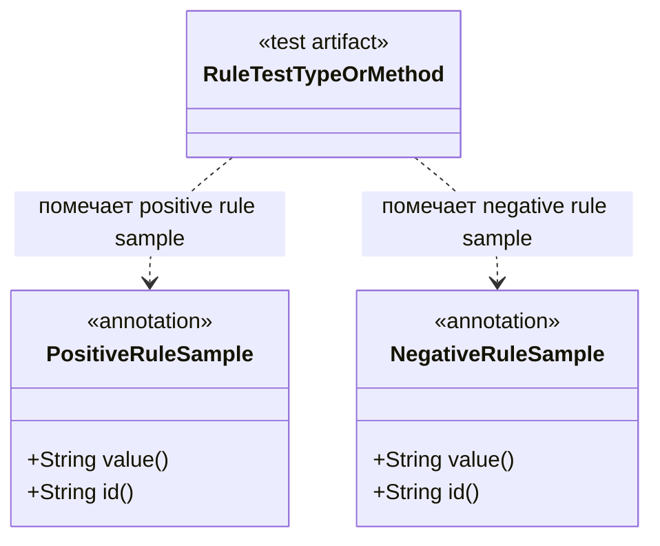

# seqra-sast-test-util

## Роль на cb2989d

`seqra-sast-test-util` — это небольшой модуль тестовой поддержки на `cb2989d`. Он не содержит production analyzer logic. Вместо этого он публикует аннотации, которые позволяют rule-тестам помечать классы или методы как positive или negative samples, указывая путь к rule fixture и опциональный rule id.

## Граница сборки

Модуль собирается как отдельный Gradle-проект и публикует Java-компонент вместе с sources jar через Maven publishing. Внутри этой build boundary наружу экспортируются только два annotation type в пакете `org.seqra.sast.test.util`.

## Отношения между сущностями

- `PositiveRuleSample` помечает тестовый класс или тестовый метод, который должен совпасть с sample правила.
- `NegativeRuleSample` помечает тестовый класс или тестовый метод, который не должен совпасть с sample правила.
- Обе аннотации содержат обязательную строку `value()` для пути к sample или rule fixture.
- Обе аннотации также содержат опциональную строку `id()` для сужения до конкретного rule case.

## Архитектура

Этот модуль ориентирован на аннотации, а не на runtime-поведение. Публикуемый jar добавляет метаданные, которые тесты могут читать или навешивать на fixtures в других частях репозитория или у downstream-потребителей. На `cb2989d` видимая реализация — это просто две runtime-retained annotations одинаковой формы: одна для positive expectations и одна для negative expectations.

## Высокоуровневый UML

## Доказательства

- `seqra-sast-test-util/build.gradle.kts`: применяет `kotlin-conventions`, включает `maven-publish` и публикует Java-компонент с optional sources jar.
- `seqra-sast-test-util/src/main/java/org/seqra/sast/test/util/PositiveRuleSample.java`: определяет runtime-retained annotation для type или method targets с `value()` и optional `id()`, а также usage comment, указывающий на путь к rule fixture.
- `seqra-sast-test-util/src/main/java/org/seqra/sast/test/util/NegativeRuleSample.java`: определяет соответствующую negative-sample annotation с теми же target и payload shape.
