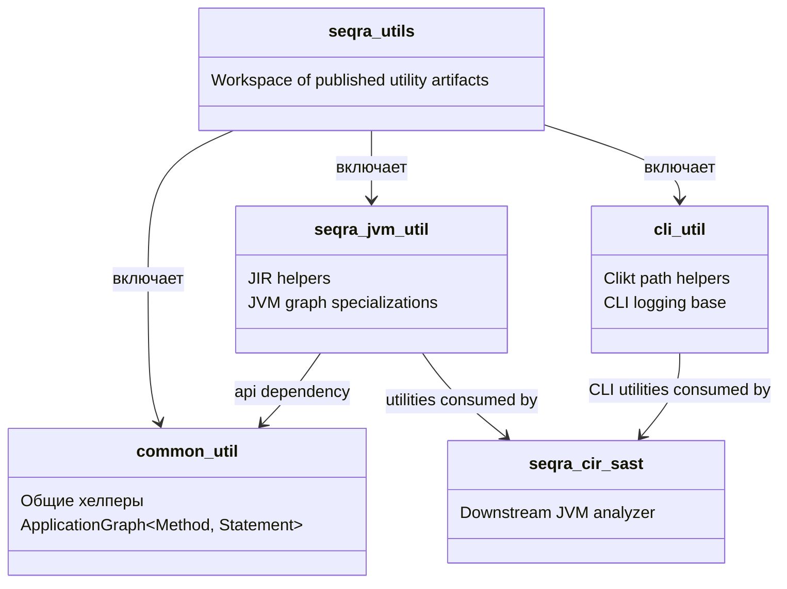

# seqra-utils

## Роль на cb2989d

`seqra-utils` — это небольшой utility workspace, а не один монолитный runtime-модуль. На коммите `cb2989d` он разделён на три публикуемых subproject: `common-util`, `cli-util` и `seqra-jvm-util`. Ключевая граница такова: `common-util` остаётся общим, `cli-util` остаётся ориентированным на командную строку, а `seqra-jvm-util` — это единственный utility-layer, который связывает эти хелперы с JVM IR types и обходом графов.

## Граница сборки

`seqra-utils/settings.gradle.kts` включает ровно три subproject. `common-util`, `cli-util` и `seqra-jvm-util` каждый применяют `maven-publish`, поэтому workspace собирается и потребляется как три отдельных артефакта, а не как один umbrella jar. Внутри этого разделения `seqra-jvm-util/build.gradle.kts` объявляет `api(project(":common-util"))`, что делает `common-util` переиспользуемым базовым слоем для JVM-specific utilities. `cli-util/build.gradle.kts` подтягивает только Clikt и Logback для command entrypoints и logging, тогда как `seqra-jvm-util/build.gradle.kts` добавляет JVM IR APIs, core IR, approximations и Kotlin reflection.

## Отношения между сущностями

Внутри `seqra-utils` есть одна восходящая связь слоёв: `seqra-jvm-util` зависит от `common-util`. Это соответствует форме кода. `ApplicationGraph` в `common-util` определяет типизированный graph contract, затем `JApplicationGraph` в `seqra-jvm-util` специализирует его на `JIRMethod` и `JIRInst`, а `JApplicationGraphImpl` даёт JVM-backed реализацию поверх `JIRClasspath` и usage data. `SeqraIr.kt` играет ту же JVM-oriented роль, добавляя conversion и lookup helpers вокруг JIR classes, methods, fields и types. `cli-util` отделён от этого graph stack: его хелперы оборачивают Clikt path parsing и настройку logging, поэтому он обслуживает command tooling, а не abstraction analysis graph.

Downstream-модуль `seqra-cir-sast/build.gradle.kts` зависит и от `seqraUtilJvm`, и от `seqraUtilCli`. Это показывает intended dependency edge: более высокоуровневые JVM-анализаторы используют JVM utility artifact для IR и graph helpers, а CLI utility artifact — для command surface concerns.

## Архитектура

На уровне subproject `common-util` — это общий фундамент. Он экспортирует utility primitives и абстрактный контракт `ApplicationGraph<Method, Statement>`, не импортируя JVM-specific types. `cli-util` — соседний артефакт, который упаковывает переиспользуемую эргономику командной строки. `seqra-jvm-util` находится выше общего слоя и адаптирует Seqra IR JVM models к общему utility vocabulary.

Это означает, что архитектура здесь не `common-util -> cli-util -> seqra-jvm-util`. Вместо этого `common-util` и `cli-util` — это sibling published utilities с разными обязанностями, и только `seqra-jvm-util` продолжает общий слой в сторону JVM-specific territory. Потребители, такие как `seqra-cir-sast`, выбирают только те utility artifacts, которые им нужны.

## Высокоуровневый UML

## Доказательства

- `seqra-utils/settings.gradle.kts`: определяет разделение workspace на `cli-util`, `common-util` и `seqra-jvm-util`.
- `seqra-utils/common-util/build.gradle.kts`: показывает, что `common-util` публикуется как отдельный артефакт.
- `seqra-utils/common-util/src/main/kotlin/org/seqra/util/analysis/ApplicationGraph.kt`: фиксирует общий контракт `ApplicationGraph<Method, Statement>` в common-layer.
- `seqra-utils/cli-util/build.gradle.kts`: показывает, что `cli-util` — отдельный публикуемый артефакт с CLI-only зависимостями.
- `seqra-utils/cli-util/src/main/kotlin/org/seqra/util/CliUtil.kt`: показывает, что `cli-util` даёт command-line path option helpers.
- `seqra-utils/cli-util/src/main/kotlin/org/seqra/util/CliWithLogger.kt`: показывает, что `cli-util` также упаковывает переиспользуемую CLI logging setup.
- `seqra-utils/seqra-jvm-util/build.gradle.kts`: показывает, что JVM-layer зависит от `project(":common-util")` и от Seqra JVM IR artifacts.
- `seqra-utils/seqra-jvm-util/src/main/kotlin/org/seqra/jvm/graph/JApplicationGraph.kt`: показывает, что JVM-layer специализирует `ApplicationGraph` для `JIRMethod` и `JIRInst`.
- `seqra-utils/seqra-jvm-util/src/main/kotlin/org/seqra/jvm/graph/JApplicationGraphImpl.kt`: показывает, что JVM-реализация разрешает predecessors, successors, callers, callees, entries и exits из JVM IR flow graphs.
- `seqra-utils/seqra-jvm-util/src/main/kotlin/org/seqra/jvm/util/SeqraIr.kt`: показывает дополнительные JVM-only helper extensions вокруг JIR classes, methods, fields и types.
- `seqra-cir-sast/build.gradle.kts`: показывает downstream-модуль, который потребляет и `seqraUtilJvm`, и `seqraUtilCli`.
